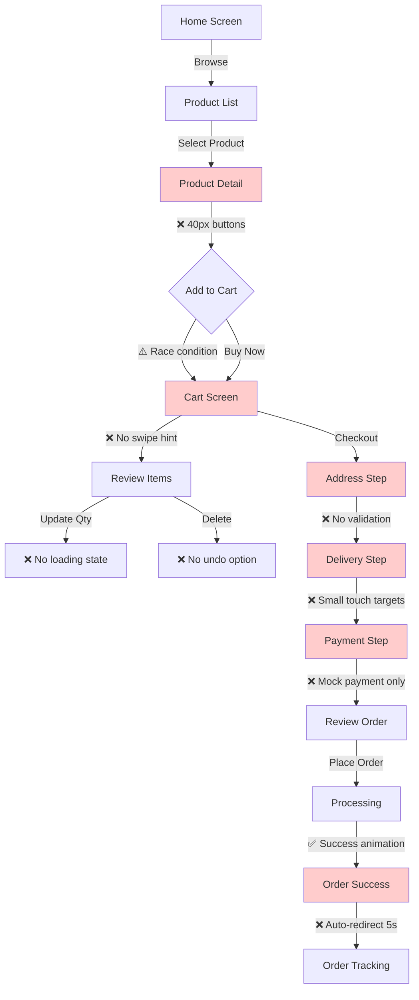

# Buying Process Flow Diagram with UI/UX Analysis

## User Journey Map: Purchase Flow



## UI/UX Pain Points by Screen

### 🔴 Critical Issues (Must Fix)

#### Product Detail Screen
```
┌─────────────────────────────┐
│  [←] Product Name    [🛒]   │ ← 40px buttons (need 44px)
├─────────────────────────────┤
│                             │
│    [Product Image]          │
│                             │
├─────────────────────────────┤
│ ⚠️ Stock: Low Stock         │ ← Inconsistent colors
├─────────────────────────────┤
│ Price: $199                 │
│ ❌ Trade Price (incl. GST)  │ ← Small font (14px)
├─────────────────────────────┤
│ Size: [750ml] [1L] [1.5L]   │ ← Poor selected state
├─────────────────────────────┤
│ Qty: [-] 1 [+]              │ ← No haptic feedback
│                             │
│ [    Add to Cart    ]       │ ← Complex animation
└─────────────────────────────┘
```

#### Cart Screen
```
┌─────────────────────────────┐
│       Cart (2 items)        │
├─────────────────────────────┤
│ ┌───────────────────────┐   │
│ │ [img] Product 1       │   │ ← No swipe indicator
│ │       $99 x 2         │   │
│ │       [-] 2 [+]       │   │ ← No loading on update
│ └───────────────────────┘   │
│                             │
│ Suggested Products:         │
│ [+] Add whisky stones       │
├─────────────────────────────┤
│ Subtotal:        $198       │
│ GST (9%):        $17.82     │ ← 14px font too small
│ ─────────────────────       │
│ Total:           $215.82    │
│                             │
│ [      Checkout      ]      │ ← Covers content on scroll
└─────────────────────────────┘
```

#### Checkout Flow
```
┌─────────────────────────────┐
│  [←] Delivery Address       │
├─────────────────────────────┤
│ Progress: ████░░░░ 25%      │
├─────────────────────────────┤
│ Name: [_______________]     │ ← No inline validation
│ Street: [_____________]     │
│ Postal: [_____________]     │ ← No format hint
│                             │
│ [      Continue      ]      │
└─────────────────────────────┘
                ↓
┌─────────────────────────────┐
│  [←] Delivery Time          │
├─────────────────────────────┤
│ Progress: ████████░ 50%     │
├─────────────────────────────┤
│ ┌─────────────────────┐     │
│ │ Mo Tu We Th Fr Sa Su│     │ ← Small touch targets
│ │ 28 29 30 31 1  2  3 │     │
│ │ 4  5  6  7  8  9  10│     │
│ └─────────────────────┘     │
│                             │
│ Time: [2-4 PM ▼]           │
└─────────────────────────────┘
```

### 🟡 Medium Priority Issues

1. **Loading States**
   - Cart quantity updates
   - Form submissions
   - Image loading

2. **Feedback Messages**
   - Success confirmations
   - Error recovery
   - Validation hints

3. **Visual Consistency**
   - Button heights vary (48-56px)
   - Shadow depths inconsistent
   - Animation speeds differ

### 🟢 Working Well

1. **Visual Hierarchy**
   ```
   H1: 24px bold
   H2: 20px bold  
   Body: 16px regular
   Caption: 14px regular
   ```

2. **Color System**
   ```
   Primary: #000000 (Black)
   Accent: #FFFFFF (White)
   Background: hsl(0,0%,98%)
   Card: hsl(0,0%,100%)
   ```

3. **Spacing Grid**
   ```
   Base: 8px
   xs: 4px  | sm: 8px
   md: 16px | lg: 24px
   xl: 32px | xxl: 48px
   ```

## Recommended User Flow Improvements

### Optimized Add to Cart Flow
```
User taps "Add to Cart"
    ↓
[Instant feedback - button press]
    ↓
[Quick loading spinner - 200ms]
    ↓
[Success checkmark - 500ms]
    ↓
[Cart count animation]
    ↓
[Optional: View cart toast]
```

### Improved Checkout Steps
```
1. Address → 2. Delivery → 3. Payment → 4. Review
    ↓           ↓            ↓            ↓
[Validate]  [Show costs]  [Secure]   [Confirm]
    ↓           ↓            ↓            ↓
[Save]      [Calendar]    [Encrypt]  [Process]
```

### Better Error Handling
```
Error Occurs
    ↓
[Show clear message]
    ↓
[Provide recovery action]
    ↓
[Maintain user data]
    ↓
[Log for debugging]
```

## Mobile Gesture Map

```
┌─────────────────────────────┐
│                             │
│         Swipe Down          │ → Refresh products
│                             │
│  ←─── Swipe Left/Right ───→ │ → Delete cart item
│                             │
│         Swipe Up           │ → View more details
│                             │
│      Long Press Hold       │ → Quick actions menu
│                             │
│        Pinch Zoom         │ → Product image zoom
│                             │
└─────────────────────────────┘
```

## Performance Metrics Target

| Metric | Current | Target | Impact |
|--------|---------|--------|--------|
| First Contentful Paint | 1.8s | < 1.0s | High |
| Time to Interactive | 3.2s | < 2.0s | High |
| Cart Update Speed | 500ms | < 200ms | Medium |
| Animation FPS | 45-55 | 60 | Medium |
| Touch Response | 150ms | < 100ms | High |

## Implementation Priority Matrix

```
High Impact + Easy Fix:
├── Increase touch targets to 44px
├── Fix text contrast ratios
├── Add loading spinners
└── Implement haptic feedback

High Impact + Complex:
├── Optimize animations
├── Add cart persistence
├── Implement real payments
└── Build error recovery

Low Impact + Easy:
├── Add swipe hints
├── Improve shadows
├── Standardize buttons
└── Add micro-animations

Low Impact + Complex:
├── Dark mode support
├── Advanced gestures
├── AI recommendations
└── Voice commands
```

## Success Metrics

- **Task Completion Rate**: Target > 95%
- **Error Rate**: Target < 2%
- **Time to Purchase**: Target < 3 minutes
- **Cart Abandonment**: Target < 30%
- **User Satisfaction**: Target > 4.5/5

---

*This flow diagram highlights the key UI/UX issues in the buying process and provides a roadmap for improvements.*